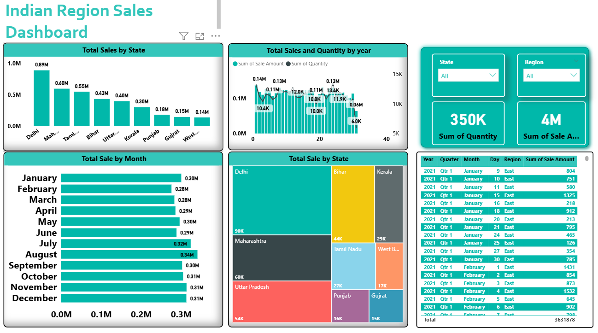

# 🗺️ Indian Region Sales Dashboard — Power BI

## 📌 Project Overview
Interactive Power BI dashboard analyzing sales 
performance across Indian states and regions 
to identify top markets and seasonal trends.

## 📊 Dashboard Preview

## 🔍 Key Insights
- Delhi ranked #1 in total sales (0.89M)
- Maharashtra second at 0.60M
- July and August are peak sales months
- Total Sales: 4M | Total Quantity: 350K units

## 🛠️ Tools Used
- Power BI
- DAX (measures and calculations)
- Power Query (data cleaning)
- Slicers and filters

## ✨ Features Built
- State and Region dynamic slicers
- KPI cards for Total Sales and Quantity
- Bar chart — Sales by State
- Line chart — Year-wise trend
- Treemap — Regional comparison
- Data table with drill-down

## 📁 Files in this Repository
| File | Description |
|------|-------------|
| `Indian-Region-Sales-Dashboard.png` | Dashboard preview image |
| `Indian-Region-Sales-Dashboard.pbix` | Power BI source file |

## 👩‍💻 About Me
Data Analyst with 4.6 years IT experience.
Open to remote freelance Data Analyst projects.
📧 ravinagujar66@gmail.com
🔗 linkedin.com/in/ravina-g-50b825b2
